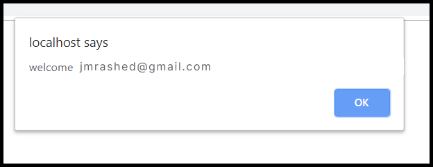

# Face Recognition Login System

This is a web-based login system that uses face recognition to authenticate users. It is built using HTML, CSS, and Python.

<hr/>

Sure, here's a general outline of how to create a face recognition login system using HTML, CSS, and Python:

- HTML/CSS: Create a basic login form with an email input, password input, and submit button. Use CSS to style the form and make it look visually appealing. You can also add a video element for capturing the user's face.
- Python: Use OpenCV to capture a photo of the user's face from the video element in the HTML form.
- Python: Use a face recognition library like Face Recognition to compare the captured photo with a pre-existing database of user photos.
- Python: If a match is found, redirect the user to their account dashboard. If no match is found, display an error message and prompt the user to try again.
- HTML/CSS: Create a dashboard page that users are redirected to upon successful login. This page can display personalized information for each user.
- HTML/CSS: Style the dashboard page to match the rest of your site's design.
- Python: Add logout functionality to the dashboard page so users can securely log out of their account.

Overall, the process involves capturing a photo of the user's face and comparing it to a pre-existing database to authenticate the user's identity. If the user is authenticated, they are granted access to their account dashboard.

# Installation

1. Clone the repository

```command
git clone https://github.com/jmrashed/face-recognition-login.git
```

2. Install the required Python packages

```command
pip install -r requirements.txt

```

3. Download the pre-trained facial recognition model from [here](https://github.com/davisking/dlib-models/raw/master/shape_predictor_68_face_landmarks.dat.bz2) and extract it to the models folder


4. Run the Flask app
```command
python app.py
```

5. Open your web browser and navigate to `http://localhost:5000`


# Usage

1. Click the "Login" button to start the face recognition process.
2. Position your face within the frame and wait for the system to recognize you.
3. If the system recognizes you, you will be logged in. If not, you will be prompted to try again.


# Contributing
Contributions are welcome! Please feel free to submit a pull request.


## Preview




## Tools & Libraries Used

- Python - face_recognition - https://github.com/ageitgey/face_recognition
- XAMPP - https://www.apachefriends.org/download.html
- Bootstrap - https://getbootstrap.com/
- CGI
  ** Note ** - These files must be hosted on XAMPP Apache server or other server, else login.py will not work.

## Working

- Install Python
- Install XAMPP
- Navigate to `htdocs` fodler and clone this project.
- Open `login.py` and make sure to replace the top comment `#! C:\Python39\python.exe` with your python path.
- Navigate to `htdocs/face-recognition-login-system` and execute the following command `pip install -r requirements.txt`
- Navigate to `xampp/apache/config` and modify the `httpd.conf` file by adding

```conf
Options Indexes FollowSymLinks Includes ExecCGI
AddHandler cgi-script .py .cgi .pl .asp
```

at the end of the file. Then save & exit

- Then run XAMPP & go to `localhost/face-recognition-login-system/login.html`
- Put all the images of students in the 'students' folder
  
- Pictures must be in the format (email_address_of_student).jpg

<br>
<b>Optional -</b> <i>you can create a seperate registration form for students, where they may upload their picture and the picture gets stored as (email_address).jpg in the 'students' folder.</i>

<hr/>

## Making it work for Windows

<p>
Go to the python's installed location , in my case it was (C:\Python39) and right click on the 
python39 folder and go to security tab and give "Full Control" permission to users
</p>
</br/>
<p>
And then go the scripts folder in python's installed path
(C:\Python39\Scripts)
</p>
and run the below commands in that folder 
<br/>

Command 1 : `C:\python39\python.exe -m pip install --upgrade pip --user`

In the above command replace the exe path with your path

Comand 2 : `pip install cmake --ignore-installed`

Command 3 : `pip install dlib --ignore-installed`

Command 4 : `pip install face_recognition --ignore-installed`

Then try to restart the XAMPP Server it should work.

If it did not work, try installing below tools on windows

- CMAKE
- Visual Studio with CMAKE Build tools installed


# License
This project is licensed under the MIT License. See the [LICENSE]() file for details.